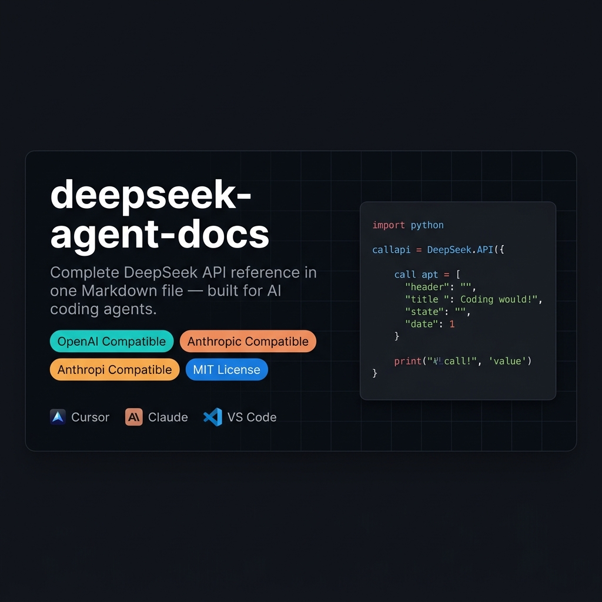

<div align="center">



<br><br>

# deepseek-agent-docs

**The complete DeepSeek API reference in a single Markdown file — built for AI coding agents.**

Give your agent one file. Get accurate DeepSeek API calls. No web crawling. No stale training data.

<br>

[](LICENSE)
[](https://github.com/prakhargaba007/deepseek-agent-docs/commits/main)
[](https://github.com/prakhargaba007/deepseek-agent-docs/stargazers)
[](CONTRIBUTING.md)
[](deepseek.md#7-openai-compatibility)
[](deepseek.md#8-anthropic-api-compatibility)

<br>

**Works with →**
[Cursor](prompts/cursor.md) · [Claude Code](prompts/claude_code.md) · [Codex CLI](prompts/codex_cli.md) · [OpenHands](prompts/openhands.md) · [Roo Code](prompts/roo_code.md) · [Continue](prompts/continue.md) · [Antigravity](prompts/antigravity.md) · [Windsurf](prompts/generic_agent.md) · [Any Agent](prompts/generic_agent.md)

</div>

---

## What is this?

When you ask an AI coding agent to write DeepSeek API code, it either:

- 🔴 **Guesses** from training data (outdated model names, wrong parameters)
- 🔴 **Crawls the web** (slow, unreliable, blocked behind auth)

This repository gives you [`deepseek.md`](deepseek.md) — a single, 75 KB Markdown file covering the entire DeepSeek API. Drop it into your project. Point your agent at it. Done.

| Without this | With this |
|---|---|
| Uses deprecated `deepseek-chat` / `deepseek-reasoner` | ✅ Correct `deepseek-flash` / `deepseek-v4-pro` |
| Guesses at `reasoning_effort` behavior | ✅ Exact parameter docs with defaults |
| Missing `extra_body` for thinking mode | ✅ Full OpenAI SDK workaround documented |
| No knowledge of context caching | ✅ Cache hit/miss rules, ~50× cost savings |
| Generic error handling | ✅ All 7 error codes with retry strategy |

---

## 30-Second Setup

**Get the file:**
```bash
curl -O https://raw.githubusercontent.com/prakhargaba007/deepseek-agent-docs/main/deepseek.md
```

**Tell your agent to use it** (add to `.cursorrules`, `CLAUDE.md`, or your system prompt):
```
When writing DeepSeek API code, read deepseek.md first. It is the authoritative reference.
Do NOT use training data or web searches for DeepSeek API details.
```

**Your first API call:**
```python
import os
from openai import OpenAI

client = OpenAI(
    api_key=os.environ["DEEPSEEK_API_KEY"],
    base_url="https://api.deepseek.com"
)

response = client.chat.completions.create(
    model="deepseek-flash",
    messages=[{"role": "user", "content": "Hello!"}],
    reasoning_effort="high",
    extra_body={"thinking": {"type": "enabled"}}  # Required for thinking mode via OpenAI SDK
)

print(response.choices[0].message.content)
```

---

## What's in `deepseek.md`?

| Section | Coverage |
|---|---|
| Models & Pricing | `deepseek-flash` (GA), `deepseek-v4-pro` (GA), Peak/Off-Peak pricing, legacy routing |
| All Endpoints | Chat Completions, Responses API (`/responses`), Files API (`/files`), FIM (Beta), List Models, User Balance |
| Parameters | Every parameter with type, default, and behavior notes |
| Thinking Mode | Toggle, `reasoning_effort` (`low`/`high`/`max`), `reasoning_content` multi-turn rules |
| Vision / Multimodal | Image formats (JPEG/PNG/GIF/WebP), URL / base64 / Files API inputs, token calculation (capped 1,024 tokens/img) |
| Files API | Upload, list, retrieve, and delete images for multi-turn chat completions |
| Streaming | SSE format, usage stats in final chunk |
| Tool Calling | Standard + strict mode, full JSON Schema reference |
| JSON Output | `response_format`, required prompt patterns |
| Context Caching | Cache hit rules, persistence timing, ~50× cost reduction |
| FIM Completion | Fill-in-the-Middle for code, beta endpoint setup |
| OpenAI Compat. | Migration steps, unsupported parameters, `extra_body` workaround, Responses API |
| Anthropic Compat. | Model mapping, SDK setup, Claude Code env vars |
| Agent Integrations | Claude Code, GitHub Copilot, OpenCode configuration |
| Rate Limits | Concurrency per model, `user_id` isolation |
| Error Codes | All 7 codes with causes and solutions |
| Best Practices | Production, prompt engineering, cost & latency optimization |
| Hidden Edge Cases | 23 undocumented caveats and compatibility quirks |

---

## AI Agent Setup

### Cursor

Add to `.cursor/rules/deepseek.mdc`:
```
Read deepseek.md before writing any DeepSeek API code.
Use deepseek-flash or deepseek-v4-pro. Never use deepseek-chat or deepseek-reasoner (retired).
Pass thinking via extra_body={"thinking": {"type": "enabled"}} when using the OpenAI SDK.
```

### Claude Code

```bash
# .env or shell profile
export ANTHROPIC_BASE_URL=https://api.deepseek.com/anthropic
export ANTHROPIC_AUTH_TOKEN=$DEEPSEEK_API_KEY
export ANTHROPIC_MODEL=deepseek-v4-pro
export ANTHROPIC_DEFAULT_OPUS_MODEL=deepseek-v4-pro
export ANTHROPIC_DEFAULT_HAIKU_MODEL=deepseek-flash
export CLAUDE_CODE_SUBAGENT_MODEL=deepseek-flash
export CLAUDE_CODE_EFFORT_LEVEL=max
```

Add to `CLAUDE.md`: `For DeepSeek API code, read deepseek.md first.`

### Other Agents

| Agent | Setup |
|---|---|
| Antigravity | Copy `SKILL.md` + `deepseek.md` to `~/.gemini/config/skills/deepseek-api/` — see [`prompts/antigravity.md`](prompts/antigravity.md) |
| Codex CLI | Pass [`prompts/codex_cli.md`](prompts/codex_cli.md) as system instructions |
| OpenHands | Use [`prompts/openhands.md`](prompts/openhands.md) as microagent context |
| Roo Code | Place [`prompts/roo_code.md`](prompts/roo_code.md) at `.roo/rules/deepseek.md` |
| Continue | See [`prompts/continue.md`](prompts/continue.md) for `config.json` setup |
| Any agent | Copy [`prompts/generic_agent.md`](prompts/generic_agent.md) into system prompt |

---

## Supported Models

| Model | Context | Max Output | Thinking | Vision | Pricing (Off-Peak / Peak per 1M) | Concurrency | Status |
|---|---|---|---|---|---|---|---|
| `deepseek-flash` | 1M tokens | 384K tokens | ✅ on by default | ✅ JPEG, PNG, GIF, WebP | $0.15 / $0.30 (input miss)<br>$0.003 / $0.006 (cache hit)<br>$0.60 / $1.20 (output) | 2,500 | **GA** |
| `deepseek-v4-pro` | 1M tokens | 384K tokens | ✅ on by default | ❌ | $0.66 / $1.32 (input miss)<br>$0.022 / $0.044 (cache hit)<br>$1.98 / $3.96 (output) | 500 | **GA** |

> Legacy aliases `deepseek-v4-flash` and `deepseek-v4-flash-vision-exp` automatically route to `deepseek-flash`. Cache hits are **~50× cheaper**. See [Section 6.6](deepseek.md#66-context-caching) for caching rules.

---

## Examples

| File | What It Shows |
|---|---|
| [`python/basic_chat.py`](examples/python/basic_chat.py) | Minimal API call + usage stats |
| [`python/streaming.py`](examples/python/streaming.py) | SSE streaming with token counts |
| [`python/thinking_mode.py`](examples/python/thinking_mode.py) | Reasoning mode + multi-turn `reasoning_content` |
| [`python/tool_calling.py`](examples/python/tool_calling.py) | Full tool call agent loop |
| [`python/json_output.py`](examples/python/json_output.py) | Structured JSON extraction |
| [`python/fim_completion.py`](examples/python/fim_completion.py) | Fill-in-the-Middle code completion |
| [`python/multi_turn.py`](examples/python/multi_turn.py) | Conversation manager with history trimming |
| [`javascript/basic_chat.js`](examples/javascript/basic_chat.js) | Node.js ESM chat |
| [`javascript/streaming.js`](examples/javascript/streaming.js) | Node.js streaming |
| [`javascript/tool_calling.js`](examples/javascript/tool_calling.js) | Node.js tool calling loop |
| [`typescript/basic_chat.ts`](examples/typescript/basic_chat.ts) | Fully typed completion |
| [`typescript/reasoning_with_retry.ts`](examples/typescript/reasoning_with_retry.ts) | Thinking mode + exponential backoff |
| [`curl/basic_chat.sh`](examples/curl/basic_chat.sh) | Minimal cURL call |
| [`curl/streaming.sh`](examples/curl/streaming.sh) | cURL + SSE parsing |
| [`curl/fim.sh`](examples/curl/fim.sh) | FIM via cURL (beta) |
| [`anthropic_sdk/basic_chat.py`](examples/anthropic_sdk/basic_chat.py) | Anthropic SDK → DeepSeek |
| [`anthropic_sdk/claude_code_setup.sh`](examples/anthropic_sdk/claude_code_setup.sh) | Claude Code env setup script |

---

## Repository Structure

```text
deepseek-agent-docs/
├── deepseek.md          ← The documentation (load this into your agent)
├── SKILL.md             ← Agent skill definition (Cursor / OpenHands / Antigravity)
├── llms.txt             ← Standard llms.txt entry point
│
├── examples/            ← Runnable examples (Python, JS, TS, cURL, Anthropic)
├── prompts/             ← 8 tool-specific agent prompts (Cursor, Claude Code, etc.)
├── scripts/             ← Maintenance scripts (link checker, formatter, ToC gen)
└── .github/             ← Issue templates, PR template, Actions workflows
```

---

## Keeping It Updated

When DeepSeek releases new features:

1. Check [api-docs.deepseek.com](https://api-docs.deepseek.com)
2. Update `deepseek.md`
3. Update `VERSION` and `CHANGELOG.md`
4. Run `python scripts/check_formatting.py` and `python scripts/generate_toc.py --write`
5. Open a PR — see [CONTRIBUTING.md](CONTRIBUTING.md)

---

## Versioning

Uses **Calendar Versioning** (`YYYY.MM.DD`) — the version number tells you when the docs were last synced, which is exactly what matters for a documentation project.

Current: `2026.09.12` · [Changelog](CHANGELOG.md) · [Releases](https://github.com/prakhargaba007/deepseek-agent-docs/releases)

---

## Contributing

- 🐛 **Wrong info?** → [Open a Bug Report](https://github.com/prakhargaba007/deepseek-agent-docs/issues/new?template=bug_report.yml)
- ✨ **Want to add something?** → [Open a Feature Request](https://github.com/prakhargaba007/deepseek-agent-docs/issues/new?template=feature_request.yml)
- 📖 **Ready to contribute?** → Read [CONTRIBUTING.md](CONTRIBUTING.md)

Issues tagged [`good first issue`](https://github.com/prakhargaba007/deepseek-agent-docs/labels/good%20first%20issue) are a great starting point.

---

## License

[MIT](LICENSE) — use freely in any project, commercial or otherwise.

---

<div align="center">

**Source**: [api-docs.deepseek.com](https://api-docs.deepseek.com) · **Maintainer**: [prakhargaba007](https://github.com/prakhargaba007)

> ⚠️ **Unofficial community resource.** Not affiliated with DeepSeek.  
> The official docs are always the source of truth. Always verify before production deployment.

<br>

**If this saved you time →** [⭐ Star it](https://github.com/prakhargaba007/deepseek-agent-docs/stargazers)

</div>
